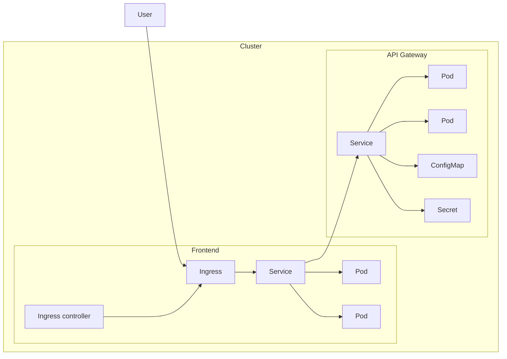

```mermaid
graph LR

user[User] --> clientIngress[Ingress]

subgraph Cluster

subgraph Frontend
clientIngressController["Ingress controller"] ---> clientIngress
clientIngress --> clientService[Service]
clientService[Service] --> clientPod1[Pod]
clientService[Service] --> clientPod2[Pod]
end

subgraph "API Gateway"
clientService --> gatewayService[Service]

gatewayService --> gatewayPod1[Pod]
gatewayService --> gatewayPod2[Pod]
gatewayService --> gatewayConfigMap[ConfigMap]
gatewayService --> gatewaySecret[Secret]
end

end
```