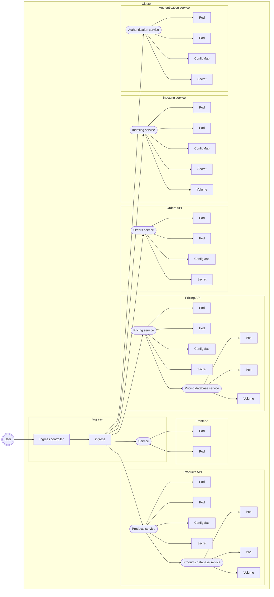

```mermaid
graph LR

user(((User))) --> ingressController[Ingress]

subgraph Cluster

subgraph Ingress
ingressController["Ingress controller"] ---> ingress
ingress --> clientService([Service])
end

subgraph Frontend
clientService --> clientPod1[Pod]
clientService --> clientPod2[Pod]
end

subgraph "Products API"
ingress --> productsService(["Products service"])

productsService --> productsPod1[Pod]
productsService --> productsPod2[Pod]
productsService --> productsConfigMap[ConfigMap]
productsService --> productsSecret[Secret]

productsService --> productsDatabaseService(["Products database service"])
productsDatabaseService --> productsDatabasePod1[Pod]
productsDatabaseService --> productsDatabasePod2[Pod]
productsDatabaseService --> productsDatabaseVolume[Volume]
end

subgraph "Pricing API"
ingress --> pricingService(["Pricing service"])

pricingService --> pricingPod1[Pod]
pricingService --> pricingPod2[Pod]
pricingService --> pricingConfigMap[ConfigMap]
pricingService --> pricingSecret[Secret]

pricingService --> pricingDatabaseService(["Pricing database service"])
pricingDatabaseService --> pricingDatabasePod1[Pod]
pricingDatabaseService --> pricingDatabasePod2[Pod]
pricingDatabaseService --> pricingDatabaseVolume[Volume]
end

subgraph "Orders API"
ingress --> ordersService(["Orders service"])

ordersService --> ordersPod1[Pod]
ordersService --> ordersPod2[Pod]
ordersService --> ordersConfigMap[ConfigMap]
ordersService --> ordersSecret[Secret]
end

subgraph "Indexing service"
ingress --> indexingService(["Indexing service"])

indexingService --> indexingPod1[Pod]
indexingService --> indexingPod2[Pod]
indexingService --> indexingConfigMap[ConfigMap]
indexingService --> indexingSecret[Secret]
indexingService --> indexingVolume[Volume]
end

subgraph "Authentication service"
ingress --> authenticationService(["Authentication service"])

authenticationService --> authenticationPod1[Pod]
authenticationService --> authenticationPod2[Pod]
authenticationService --> authenticationConfigMap[ConfigMap]
authenticationService --> authenticationSecret[Secret]
end

end
```