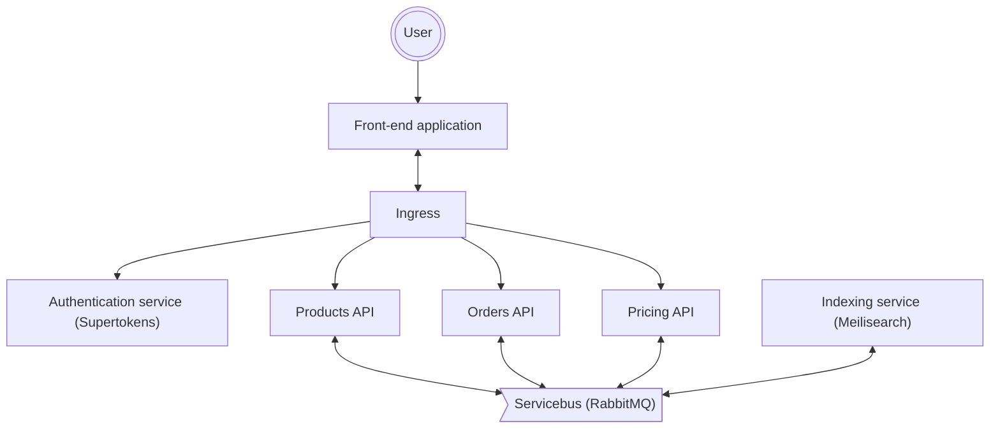

```mermaid
flowchart TD
    user(((User))) --> frontend["Front-end application"]

    frontend <--> gateway["Ingress"]

    gateway --> authentication["Authentication service (Supertokens)"]

    gateway --> products["Products API"]
    gateway --> orders["Orders API"]
    gateway --> pricing["Pricing API"]

    products <--> servicebus>"Servicebus (RabbitMQ)"]
    orders <--> servicebus
    pricing <--> servicebus

    indexing["Indexing service (Meilisearch)"] <--> servicebus
```