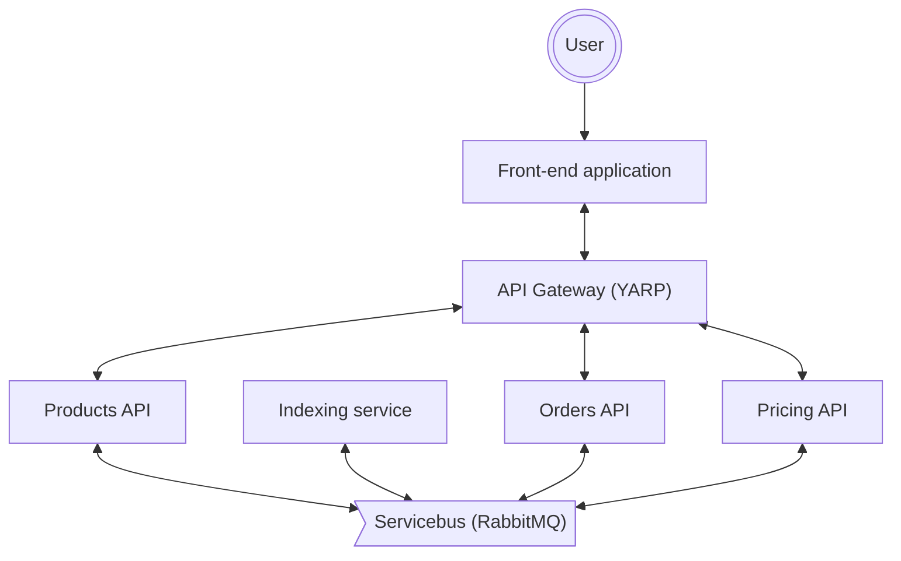

```mermaid
flowchart TD
    user(((User))) --> frontend["Front-end application"]

    frontend <--> gateway["API Gateway (YARP)"]
    
    gateway <--> products["Products API"]
    gateway <--> orders["Orders API"]
    gateway <--> pricing["Pricing API"]

    products <--> servicebus>"Servicebus (RabbitMQ)"]
    indexing["Indexing service"] <--> servicebus
    orders <--> servicebus
    pricing <--> servicebus
```